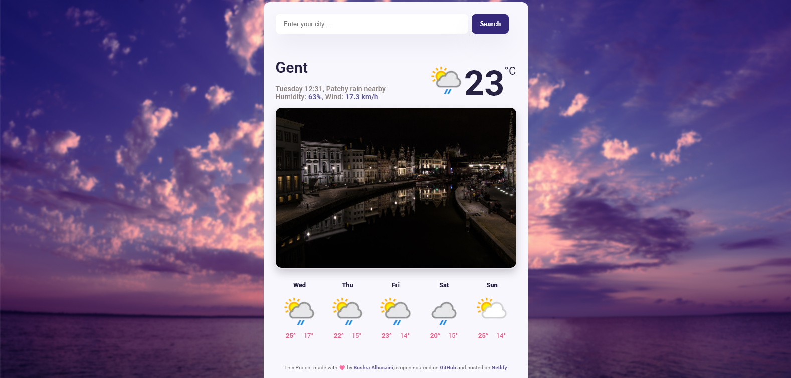

# Climate-Compass

> Climate-Compass is a weather forecast application that provides the real temperature for 5 days and a city photo The application is designed to be user-friendly, with a clean and intuitive interface that makes it easy

## Features

- 5-day weather forecast with real-time temperature updates
- City photo display
- Built with HTML, CSS, and vanilla JavaScript
- Utilizes an API for weather data

## Screenshot

## live Demo

You can find the app on [Netlify]()

> Thank you for visiting 😊

