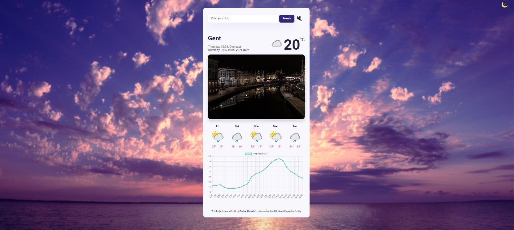
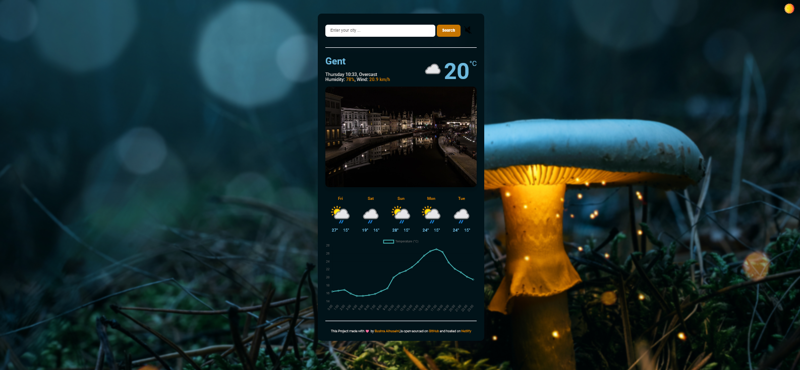

# Climate-Compass

> Climate-Compass is a weather forecast application that provides the real temperature for 5 days and a city photo The application is designed to be user-friendly, with a clean and intuitive interface that makes it easy

## Features

- 5-day weather forecast with real-time temperature updates
- City photo display
- Built with HTML, CSS, and vanilla JavaScript
- Utilizes an API for weather data
- **Dark and Light Theme**: Switch between two stylish themes to suit your preference
- **Immersive Sound Experience**: Each theme comes with its own unique sound effects to enhance the user experience
- **Hourly Forecast Chart**: Visualize the temperature forecast for the next 24 hours with our interactive chart

## Screenshot

## live Demo

You can find the app on [Netlify](https://b-climate-compass.netlify.app/)

> Thank you for visiting 😊

